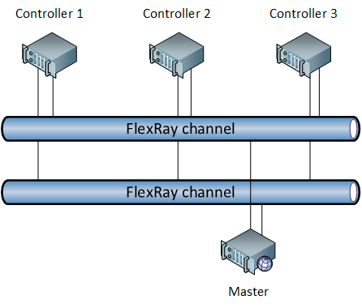
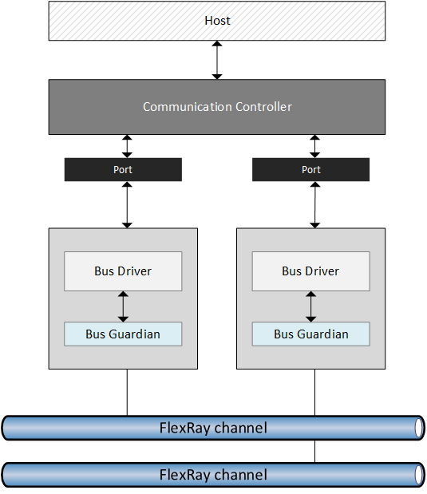

# FlexRay

In 1998 an analysis driven by BMW over the many protocols employed in automotive showed that current networking technologies were not enough to serve future generations of cars, especially when considering X-by-wire.

In order to cope with more demands for automotive, the [FlexRay Consortium](https://en.wikipedia.org/wiki/FlexRay) was created and the FlexRay protocol was created a few years later targeting the following requirments:

- Deterministic media access scheme
- Scalability
- Performance
- Bandwidth
- High redundancy for better error handling
- High reliable fault management with reporting to application

## Network structure
FlexRay operates with the following basic characteristics:

- Bandwidth up to 10 Mbit/s.
- Payload data up to 256 bytes.
- Modified [TDMA](https://en.wikipedia.org/wiki/Time-division_multiple_access) channel access arbitration mechanism.
- Indirect addressing. COntrollers do not transmit frames using addresses, because of TDMA, controllers know which controller is sending a frame in a specific slot.

The protocol targets the **Powertrain** and **Chassis** function domains and is going to become the de-facto standard in many automotive systems effectively replacing [CAN](../can/intro.md).

Its first adoption was in 2008 when BMW employed the protocol in one of his models using a bus network.

### Network design
The protocol provides ECUs that can be interconnected on a wired network which can be shaped into **many different supported topologies**, the most common being the bus. 

All ECUs include:

- An interface with the upper layers (the host).
- An integrated Communication Controller (CC) providing communication services and connected to the physical layer through many ports (via different BDs).
- A Bus Guardian (BG) can be integrated into BDs.
- One or more Bus Drivers (BD) providing access to different channels on the physical layers (one driver per channel).

The host can access communication services via the CC. This component employs ports to connect to the physical layer; actually each port from the CC is connected to a BD which regulates the access to one single channel. It means that transmissions can be sent to different channels.

### Redundancy handling
FlexRay makes redundancy a core feature and allows different configurations:

- **Single channel** CCs are all connected to the single channel via one single port.
- **More channels** CCs are connected to many channels via one port per each. CCs choose on which channel routing the frame. Since more channels can be used to transmit different frames at the same time, the total bandwidth can be increased depending on the number of independent channels $$n$$: $$B = n \cdot b$$ (where $$b$$ is the bandwidth of each channel).
- **More redundant channels** CCs may use 2 channels to send the same frame at the same time. This is a **space redundancy** allowing the protocol to be robust in case the transmission on one channel fails.
- **Time redundant channels** CCs can decide to send the same frame on the same channels (at the same time) twice after a certain delay.  The employment of **time redundancy** or **time/space redundancy** is an option to guarantee that a frame arrives at destination with extremely low fault probability.

## Medium access
A modified TDMA is employed and it is called: _Flexible Time Division Multiple Access_ (FTDMA), also known as _Minislotting_. As every TT-based approach,  a transmission cycle controlled by the master, called _Communication Cycle_ is to be considered and in the context of that cyckle, all frame exchanges are orchestrated by the master itself. The cycle is divided into phases called _segments_:

1. Network communication time
    1. **Static segment** Mandatory (a minimal part must be guaranteed). Consists of slots of fixed duration. Provides **deterministic communication timing** for controllers, each of which has one time slot in the segment assigned to itself for transmission.
    2. **Dynamic segment** Optional. A fixed duration timeframe subdivided into _minislots_ (slots which lower duration than those in the statis segment) each of fixed duration. Provides **priority based scheduling** of frames with **support for preemption** in transmissions. 
    3. **Symbol window** Optional. A time slot (same lingth as slots in the static segment) used by the protocol for control infromation exchange.
2. **Network idle segment** Mandatory. Protocol control information exchange.

### The static segment
In the static segment, slots are assigned to controllers. This segment can be configured by specifying the number of slots and the duration of each slot. These settings have to be the same for all controllers (a so called **global contract**).

Each slot is exclusively owned by one controller and this setting is **per-channel** and is saved in the controller! It means that different channels can have a different slot assignment configuration. But one thing all channels share is the number and duration of slots! So it is possible, in a 2-channel network, to have in the same slot, both channels experience the transmission of 2 different frames by 2 different controllers.

**Frame identification** Identifying transmitting controllers is easy because of TDMA in this segment. The slot assignment configuration, saved per channel in each controller, provides the information for identifying transmitting controllers. It means that the frame itself can be identified by its slot position. The protocol, however, provides a _Message ID_ field in the payload section of the frame which can be used for identification. This ID provides an identification of the information being transmitted.

Because of all these properties, the static segment provides a a deterministic communication timing in which identification and medium access is all driven by the TDMA (controlled by the master).

### The dynamic segment
This segment has a fixed duration expressed in number of minislots. While the static segment does not have a fixed length (it is derived from the number of configured slots), the dynamic slot has a fixed length.

A **minislot** has a fixed length $$l_s$$ and is much lower than the one of a normal slot $$l_S$$: $$l_s \ll l_S$$. A minislot is not able to accomodate a frame. Also, similarly to slots in the static segment, **each minislot is exclusively owned by one controller** and a controller can transmit only in its own minislot.

**Configuration** The length of a minislot (configurable as a global contract) is mainly determined by parameters related to the physical layer like **propagation delay** and **clock skew** across controllers.

#### Transmission dynamics
When the dynamic segment starts, each controller keeps a _Minislot counter_ $$C_s$$ which has to be the same across all of them (synchronization is required). 

1. The counter is initialized to $$C_s = 0$$ at the beginning of the segment.
2. Controllers which have a frame to send wait for their own minislot. As minislots pass, the counters ar increased: $$C_s = C_s + 1$$.
3. Once a controller reaches its minislot, it starts sending the frame. This is sensed by other stations which will not transmit later and will hold the counter $$C_s$$ to its current value.
4. As the transmitting controller sends the frame and all controllers hold their counters, what the network experiences is basically an expansion of the minislot of the transmitting controller.
5. The transmitting controller will keep sending until the frame reaches its tail, so the last minislot is used.
6. On the next slot, controllers keep incrementing their counters.

> The expansion of a minislot reduces the number of minislots available in the dynamic segment.

#### Priority handling
This mechanism enables a priority handling of frames and a **demand-driven access strategy**. By ensuring that high priority controllers are assigned an earlier minislot, the protocol will take care of guaranteeing the correct **preemption** of high priority messages over low priority ones.

> Minislots are expanded only in case the controller has something to send.

**CAN and FlexRay** In chapter [Advantages and disanvantages of CAN](../can/pros-cons.md) we detailed that one of the characteristics of CAN is its non-preemptive behavior. FlexRay tries to overcome this limitation so that if a higher priority frame is to be sent, that will always take priority.

### Configurations
Given the mandatory/optional segments, 3 possible configurations can be considered (the idle segment is always considered to be present, so here we consider the communication time):

- **Pure static configuration** Only the static segment is present.
- **Mixed configuration** Static and dynamic segments are both present. The way bandwidth is balanced between them opens up to many possible sub-configurations. This configuration is very common.
- **Pure dynamic configuration** All bandwidth is assigned to the dynamic segment. The static segment has the minimum length.

The static segment, since mandatory, has a minimum length of 2 slots called: **degraded static segment**.

## Bandwidth utilization
High throughput is one of the objectives of FlexRay. Given its structure, statistics showed that:

- Best case bandwidth utilization is about 70%.
- Average bandwidth utilization is 60%.

Percentages are referred to nominal maximum bandwidth supported by the protocol: 10 Mbit/s.

## Why FlexRay is important
Today this protocol is regarded as one of the most efficient and powerful. The reason is simple:

> FlexRay successfully attempts to get the most from the strong points of [CAN](../can/intro,md) and TDMA-based protocols.

The idea is simple:

- CAN, by means of the Binary Countdown, is able to achieve scheduling via a distributed priority queue. This approach lacks the determinism in transmissions as it does not guarantee with extreme accuracy when a frame will be sent.
- TDMA-based protocols are able to achieve high determinism in transmissions. This approach cannot guarantee priorities in scheduling as everyone will have a slot for transmitting; if someone has, in a certain moment, a very high priority message to transmit and its slot is passed, that station will have to wait.

FlexRay is able to achieve determinism in the static segment and priority handling in the dynamic one. Also, thanks to minislotting, **preemptive priority scheduling** is possible as frames with higher priorities will be scheduled first in the dynamic segment.
