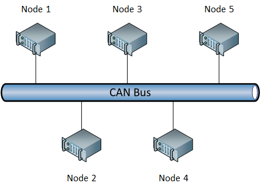
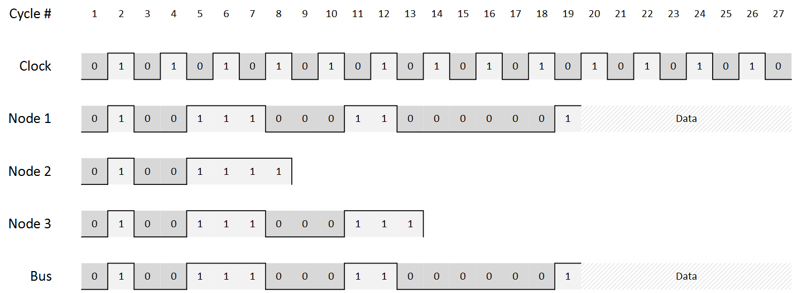

# Bus arbitration

Here we want to consider what we have learnt so far and about the way CAN arbitrates the bus and make some examples of how transmission happen on the bus. For all examples, we are going to cinsider a basic CAN network with 6 nodes (all producers and consumers).

**Note** In these examples we will not considr the bit stuffing occurring on the bus as it pointlessly complicates scenarios.



## Binary countdown
We know that frames are handled in a distributed prioritized queue thanks to the _Binary countdown_. Let's visualize it in action by considering that `Node 1`, `Node 2` and `Node 3` respectively want to send messages with the following IDs:

```
M1 = 10011100011 [Data]
M2 = 10011110111 [Data]
M3 = 10011100011 [Remote]
```

It means that the frames that will be sent out are (considering CAN 2.0A frames):

```
M1 => 0 10011100011 0 0 0 0001 XXXXXXXX
M2 => 0 10011110111 0 0 0 0010 YYYYYYYYYYYYYYYY
M3 => 0 10011100011 1 0 0 0001
```

We are of course visualizing only the part from SOC to _Data_ with some random data. Let's see what happens on the bus as soon as these nodes start transmitting at the same time.



As we can see, the frame which wins the contention is `M1` because `M1 = M3 < M2` and `M1` is a data frame which take priority on `M3` which is a remote frame on the same variable.

1. Until the 7th cycle, all frames generate no collision yet. 
2. However, at the 8th cycle `Node 2` transmits `1` which, in AND with the other IDs, collides on the bus. `Node 2` only feels the collision and knows it lost the contention, thus holds off and interrupts the transmission of frame `M2`.
3. `Node 1` and `Node 2` keep transmitting until the 13th cycle which marks the transmission of the RTR bit. Since `Node 1` is transmitting a data frame, it takes priority over `M3`. `Node 3` will stop and `Node 1` will complete its transmission.

**Important** Remember that once a frame is being sent, other station that need to transmit something will have to wait to hear the EOF and IMF.
