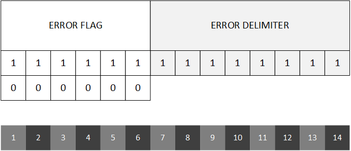

# Error frame

The structure of an error frame is different:

- **Error flag** This field is 6 bits and is used to mark the type of error. This field is **not subjected to bit stuffing**.
    - **Active Error Flag** All dominant (`000000`). Note that, since purposely not stuffed, this sequence of bits will generate an error on the bus.
    - **Passive Error Flag** All recessive (`111111`). This sequence is passive on the bus as it merges in the idle time.
- **Error delimiter** This field is always 8 bits long and is always recessive (`11111111`).

This frame is special as it is not sent as a whole, but in two different stages. Nodes typically send the _Error flag_ first, and then, after a certain time, they will send the _Error delimiter_.

## Error states
Every node keeps 2 error counters:

- Receiver Error Counter (REC) $$C_{\text{R}} \in \textbb{N}$$
- Transmit Error Counter (TEC) $$C_{\text{T}} \in \textbb{N}$$

Both counters start with a value of `0` and they get incremented/decremented depending on the node's behavior. The higher the value of one of these counters, the worse is the efficiency of the node.

Every node can have 3 error states basing on the values of these 2 counters. Its behavior, error-wise, depends on its current state:

| State name | Condition | Capabilities | Error flag |
|:----------:|:---------:|:-------------|:----------:|
| _Error-Active_ | $$C_{\text{R}} \leq 127 \land \text{T}} \leq 127$$ | Takes part in communications | [Active Error Flag](frame-error.md#active-error-flag) |
| _Error-Passive_ | $$C_{\text{R}} > 127 \lor \text{T}} > 127$$ | Takes part in communications (8 bit delay) | [Passive Error Flag](frame-error.md#passive-error-flag) |
| _Bus-Off_ | $$C_{\text{R}} \geq 256 \lor \text{T}} \geq 256$$ | Cannot transmit but can receive | N/A |

The last column indicates what _Error flag_ the node will send on the bus in case it detects an error. Depending on it scurrent state, it might send an [Active Error Flag](frame-error.md#active-error-flag) or a [Passive Error Flag](frame-error.md#passive-error-flag).

## Active Error Flag
When a node encounters an error condition and is in _Error-Active_ state, it transmits an _Active Error Flag_ on the bus. 

Since this error flag (purposely) violates the bit stuffing condition, all nodes on the bus will react in a chain reaction by also sending an _Error flag_ (according to the last column of the table) or nothing if it is in the _Bus-Off_ state. So a chain reaction will occur notifying all the other nodes that something has happened.

### Bus error flag occupation
As soon as an _Active Error Flag_ is sent out, a chain reaction will occur. The bus will possibly start being occupied by dominant bits if nodes are operating in normal conditions. Every node who sent an _Error flag_, will wait for the bus to present a recessive bit in order to start senidng the _Error delimiter_. Remember that the bus always performs an AND arbitration, so even if _Passive Error Flags_ are sent, they might be overriden by _Active Error Flags_, it means that it will take some time before the bus gets free (back to idle) again.

The condition for having 1 recessive bit is needed before sending the delimiter in order to wait for all stations to send their _Error flags_. Once the bus is free, all stations will transmit the delimiter (which is basically an 8 bit long idle time) after which the bus will get back to its normal operative state.

## Passive Error Flag
When a node in _Error-Passive_ state encounters a problem, it will send a _Passive Error Flag_. However, since this flag is all recesive, nobody will hear it and nodes will not react, The chain effect will not occur.

## In case of Bus-Off
When a node is in _Bus-Off_ state it is not able to transmit. When it encounters an error the only thing it can do is incrementing its internal counters. When such a state keeps persisting after a certain amount of time, the node might be declared hopeless, thus requiring, worst case scenario, a manual reset after a complete exclusion from the network.

However a resuscitation is possible. If both the error counters get decremented and go down below the 256 threshold, the node will go back in the bus.
