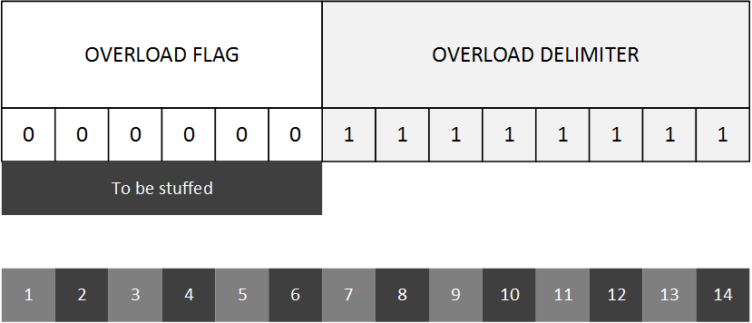

# Overload frames

Overload frames are used for synchronization purposes in order to let slow consumers catch up with fast producers.

- **Overload flag** A 6 bit sequence all dominant (`0`). This sequence is subjected to bit stuffing.
- **Overload delimiter** An 8 bit sequence all recessive (`1`).

When a node needs a value for a variable, but the producer for that value is much faster, the node can decide to make the transmission on the bus slow down so it can catch up. It sends an overload frame.

**Reception** When a node receives an overload frame, it will reply by sending another overload frame on the bus. In order to avoid the infinite overload transmission, one node can send no more than 2 consecutive overload frames. This mechanism basically generates delay on the network, thus giving more time to slow devices.

## Overload frames today
CAN has improved so much that today is very rare to see network employing overloading frames.
