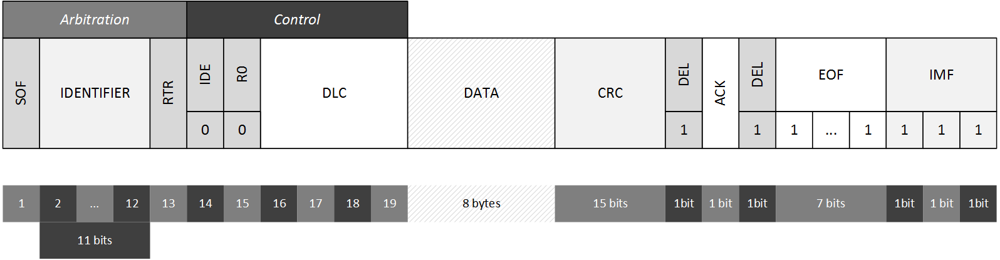
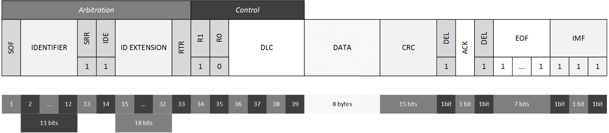

# Frame format

Frame formats are defined in the standard document for CAN. Since we have 2 standards: CAN 2.0A and CAN 2.0B, there are 2 different frame formats for messages.

## CAN 2.0A
The original standard has this frame structure:

In both versions of the standard, many fields are shared and some of them are different.

- **Arbitration** This field is the compound of the SOF, _Identifier_ and RTR fields.
- **Start Of Frame (SOF)** When the bus is idle (recessive) and one node starts transmitting, in order to mark the beginning of a frame, a SOF dominant value is sent. The SOF  has also the purpose of synchronizing consumers.
- **Identifier** The identifier is an 11 bit field, which allows $$2^11 = 2048$$ possible IDs. It means that an ordinary CAN networks can support up to 2048 different field variables.
- **Remote Transmission Request (RTR)** The consumer sends a frame with an identifier to signal that he needs a value for that variable, this bit will indicate that the frame is a request for that value to be sent by the node responsible for the needed variable.
    - **Data frame** A frame used by producers to emit a variable's value. RTR is set to dominant (`0`).
    - **Remote frame** A frame used by consumers to signal the need for a variable's value. RTR is set to recessive (`1`). 
- **Identifier Extension (IDE)** Used to identify normal from extended frames. Normal frames have thif flas set to dominant (`0`).
- **Reserved dominant** A reserved bit set to dominant (`0`).
- **Data Length Code(DLC)** A 4 bit field specifying the length (in bytes) of field _Data_. It means that a CAN frame can contain a value up to $$2^4-1 = 15$$ bytes. However controllers will never send a value longer than **8 bytes**.
- **Cyclic Redundancy Check (CRC)** A [CRC](https://en.wikipedia.org/wiki/Cyclic_redundancy_check) error detecting code on the previous part of the frame.
- **Acknowledgement slot (ACK)** A field used by producers and consumers to make sure data is properly transmitted.
- **End Of Frame (EOF)** A stream of 7 recessive bits used to notify the end of a successfully sent frame. Note that this field is not affected by stuffing.
- **InterMissoin Frame (IMF)** A 3 bit field with all recessive value marking a separation between one frame and the other. Note that this field is not affected by stuffing.

### Bit stuffing
Bit stuffing is only applied from SOF until CRC. Everything following CRC is a control frame which has a fixed structure and does not need stuffing.

### Data frames vs remote frames
Because of the RTR field, in case 2 nodes send 2 frame with the same identifier, a data frame and a remote frame, the data frame will take priority because, after the SOF, the identifier will be the same and the discriminant will be the RTR bit.

### The acknowledgement process
Acknowledgement is highly performat process in CAN. CAN wants to be reliable, thus it does not implement an acking mechanism that requires nodes to send an ACK after receiving the frame. 

> The acking process happens while the frame is being transmitted.

When a producer sends a variable on the bus, consumers read it. Let us consider that exactly 1 consumer is consuming the frame as it is being transmitted by the producer.

1. After field _Data_ has been sent, the consumer knows that CRC will follow (by using the DLC field).
2. After the CRC has been acquired by the consumer, the consumer computes the CRC on frame he received and compares the 2 check values.
3. The delimiter bit for CRC signals the consumer that the producer is about to send the ACK bit.
4. The ACK field is being sent and it has a recessive (`1`) value.
5. If the CRC values are the same, the consumer has successfully acquired the produced value and it overrides the ACK bit with a dominant (`0`) value. So the ACK will now have a dominant value, thus notifying the transmitter that the frame was received correctly.
6. If the CRC values are not the same, the consumer knows that it received a bad frame and will try to signal it to the transmitter by not overriding the ACK bit. So the ACK bit will remain recessive (`1`), thus notifying the transmitter that its frame was not received properly.

If more consumers are reading the frame being transmitted and only some of them successfully read it, the other consumers which attempted to signal the transmission failure will not be taken into consideration as they will not override the ACK bit to a dominant level (operation that was performed by those stations which correctly received the frame). For this reason the ACK slot bit must be interpreted in the following way:

> The ACK slot bit is used by transmitters in order to check that at least 1 node has properly received the frame.

If no one is listening to a frame being transmitted, the ACK slot will keep its recessive state, thus causing no harm.

--- 

## CAN 2.0B
The extended protocol has a slightly different frame structure:

CAN 2.0B was inroduced mainly to support more extended networks and a very high number of devices and field variables, that is why the identifier field is longer.

- **Arbitration** The arbitration field is a compound of the SOF, _Identifier_, SRR, IDE, _ID Extension_ and RTR fields.
- **Identifier** The field now is 11 + 18 bit long. 29 bits allow up to $$2^{29}$$ field variables (more than 500 millions).
- **Substitute Remote Request (SRR)** This bit is always sent recessive (`1`). In both frame formats, the IDE is the 14th bit. In order to preseve the structure of the frame, the SRR makes sure that normal frames take priority over extended frames in case two nodes (2.0A and 2.0B) send two frames (one normal and one extended) for the same variable. In such a situation, in both cases where the 2.0A frame is a data frame or a remote frame, it will take priority.

> Extended frames, since longer than normal ones, cause the network to experience decay in transmission efficiency. Therefore, extended frames are not used very often.

## CAN 2.0B Passive
It is not possible to use CAN 2.0A and CAN 2.0B controllers on the same bus as this leads to transmission errors, thus making the network enter an unstable state. That happens because CAN 2.0A controllers cannot handle the extended ID. 

In order to cope with this condition, a third category was introduced: _CAN 2.0B Passive_. These controllers are an advanced version of CAN 2.0A controllers as they basically send only normal frames but they can receive also extended ones (which will be ignored). This enables normal and extended frames to be sent on the same bus: by using CAN 2.0B and CAN 2.0B Passive controllers.