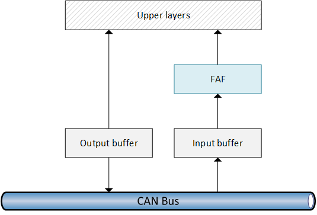

# Models for information exchange

The CAN protocol can be used in some specific information exchange applications. In particular 2 models are very suited for CAN:

- **Producer/consumer** As mentioned before, CAN is especially suited for a model based on producers and consumers. Producers write variables and consumers read them. Consumers have also the ability to prompt producers to emit the value of a certain variable.
- **Master-slave** A master/slave model can be successfully implemented with CAN. When the master needs a value, it will send a _Request frame_ in broadcast and wait for the answer.

## Frame filtering
In both models one feature is critical: since everything is basically broadcasted, nodes must have a way to filter out frames they are not interested in, so they can let through (to upper layers) only those they need.

The filtering logic is embedded in the controller. The _Frame Acceptance Filter_ (FAF) is a unit which takes the frame being stored in the _Input Buffer_ and analyze it in order to determine whether it is of any interest. The upper layers will receive only the frames that are considered valuable, filtering out the rest as clutter.

---

## Responsiveness
Differently from other protocols like [Profinet IO](../rte/profinetio.md) or [EPL](../rte/epl.md), the information is written on the bus as soon as it becomes available from upper layers. There is no need to wait for a central node to grant access to the channel. This happens because CAN is able to handle priorities thanks to the _Binary countdown_.

## Predictability
CAN however is not a leading solution when it comes to pretictability. Because there is a contention on the bus, a frame might have to wait some time to be transmitted. However if priorities are well dimensioned, the RTA guarantees that certain deadlines can be observed, especially in the case of periodic variables.

In case of aperiodic variables, CAN will not behave so well unfortunately. So the protocol, though suited for periodic traffic, cannot handle the mixture of periodic and aperiodic traffic very well.