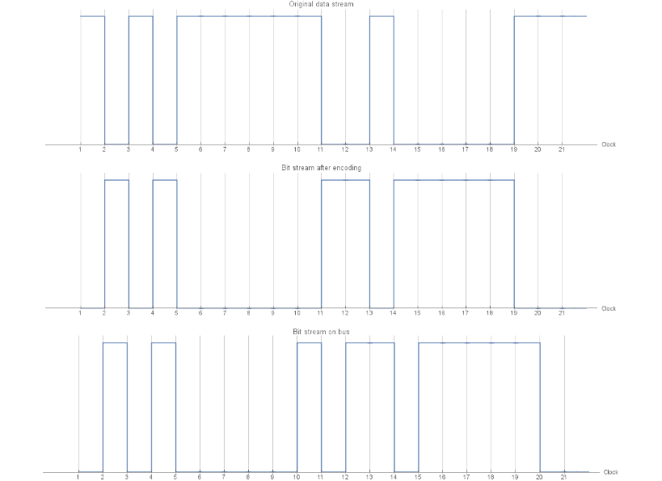

# Bit encoding and synchronization

Data is written on the bus by using the [Non Return to Zero (NRZ)](https://en.wikipedia.org/wiki/Non-return-to-zero) encoding.

## Electrical values
Two electrical values are allowed: 

| Name | Symbol | Logic value (application) | Logic value on bus |
|:----:|:------:|:-------------------------:|:------------------:|
| Dominant | D | 1 | 0 |
| Recessive | R | 0 | 1 |

Since CAN assigns higher priority to lower levels, the low value is assigned to the dominant level.

## Synchronization
Stations on the bus must be synchronized. In fact, all nodes must be able to receive the bits of the frame being transmitted on the bus at the same time. When a frame is being transmitted, the other nodes must be synchronized while reading the same single bit. This mechanism is vital and critical because [contention management](phy-collision.md#contention-management) relies on it. Every node must read the value on the bus while transmitting in order to detect a collision (knowing that he failed the transmission as another node is sending a higher priority frame).

To achieve synchronization, the data being transmitted itself is used. Nodes synchronize on the signal's **front edges**. 

### Bit stuffing
Being a NRZ encoding, the synchronization mechanism is threatened in case of long sequenced of bits having the same value. In order to always guarantee the presence of edges (the only mean nodes have for synchronizing), the [bit stuffing](https://en.wikipedia.org/wiki/Bit_stuffing) technique is used.

> When encoding, for every 5 consecutive bits having the same value, a 6th bit is generated having the opposite value. 

So if the data being transmitted is: `101011111100100000`, the dominant/recessive encoding will turn that stream into: `010100000011011111`, so the output bitstream on bus will finally be: `01010000010110111110`. The picture below shows this: 

Decoding the output stream is easy:

> When decoding, For every 5 consecutive bits having the same value, the following (opposite) bit is removed.

**Fun facts** It has been calculated (via simulation) that, in average, every frame has a number of stuff bits ranging from 2 to 4.

**Important** Bit stuffing is not always applied. When one frame is sent, not all fields are transmitted by using the bit stuffing encoding. Only the variable part of the frame is subject to stuffing, the last part of it has a fixed format which ensures a good number of edges.
