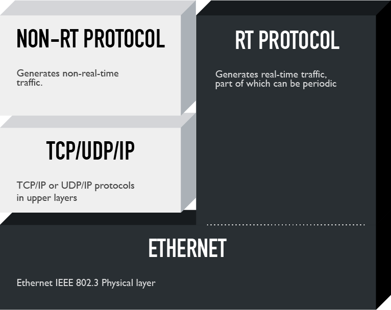

# Realization Modified Ethernet

Solutions with strict constraints for real-time traffic need to change the hardware. In this realization, the real-time traffic bypasses upper layers and goes straight to the physical layer.

As it is possible to see, the physical layer employs a modified version of Ethernet.

## Preferred topologies
The most preferred topology for these architectures is the [daisy chain](https://en.wikipedia.org/wiki/Network_topology#Daisy_chain) as it enables ease of of cabling and reduces the costs associated to that. The topology that for sure we try to avoid is the [star](https://en.wikipedia.org/wiki/Star_network) which, on the opposite, implies a high cabling effort.

In order to successfully deploy a daisy chain network, or a ring which is also ok, it is necessary to have a switch on every connected device. In these topologies, in fact, every end station must also be able to act like a switch. For this reason, field devices complying to a Modified Ethernet realization already have it internally embedded.

## Traffic handling
In Modified Ethernet realization all real-time devices must modify the Ethernet protocol; however devices which do not send real-time traffic can avoid it and can simply employ the normal protocol stack (TCP/IP, UDP/IP on normal Ethernet) in order to send non-real-time traffic.

## Case study
A technology employed by several manufacturers implementing this realization is [Profinet IO](profinetio.md).