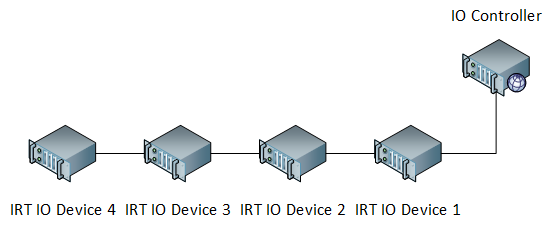
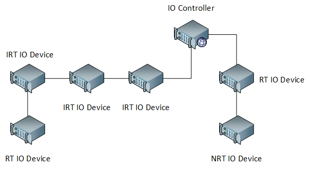
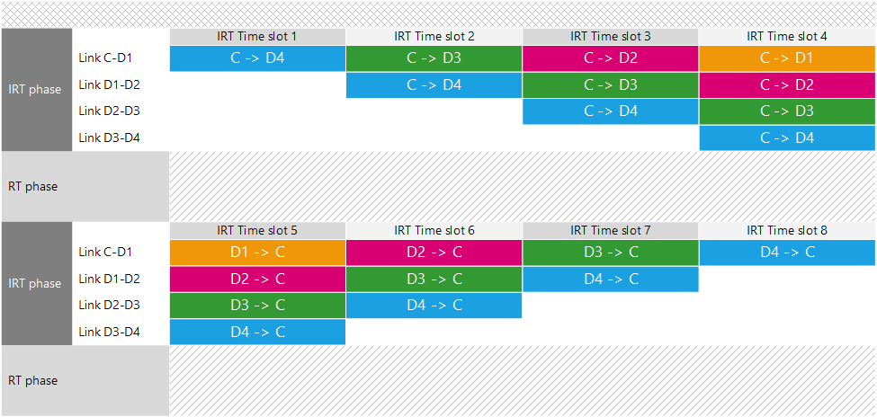

# Profinet IO

The [Profinet IO](http://www.profibus.org) protocol appears in CPs 3/4, 3/5 and 3/6 in the the CPF-3 definet in IEC 61784-2. It is vastly used by many manufacturers (including [Siemens](https://www.siemens.com)) and supports highly time-critical applications with strict constraints on delivery time and jitter.

**Class** Profinet IO fulfills the requirements for [Class 3](pi.md#motion-control-class) in IEC 61784.

## Network structure
Profinet IO defines two categories of devices:

- **IO controllers** An Ethernet subnet is controlled by one special device which orchestrates transmissions.
- **IO devices** Devices which might have real-time traffic to send.

All nodes can be arranged into different topologies, though daisy-chain and ring are preferred. It is not necessary to specify which topology one network is using as IO controllers are equipped with [LLDP](https://en.wikipedia.org/wiki/Link_Layer_Discovery_Protocol) which detects the topology automatically.

The above picture shows an IRT daisy chain segment where one IO controller is in charge of different IO devices.

### Network settings
In order to associate IO devices to IO controllers, an _Application Relation_ (AR) is defined between an IO controller and an IO device. In the context of an AR, many _Communication Relations_ (CR) are defined in order to distinguish the transmission type (alarms, data, etc.).

In order to properly set the network for orchestrating transmissions, every IO device is described in its _General Station Description_ ([GSD](http://www.profibus.com/products/gsd-files/)) file which uses an [XML](https://en.wikipedia.org/wiki/XML)-based markup language called _GSD Markup Language_ ([GSDML](http://www.profibus.com/nc/download/device-integration/downloads/gsdml-specification-for-profinet-io/display/)).

#### Different subnets
In Profinet IO, IO devices can belong to different networks. CRs define what kind of linking exist between nodes. Also different synchronization clock protocols can cohexist.

**IRT settings** One important aspect to consider is that IO devices which are expected to take part to IRT transmissions, must be interconnected together generating a connected network with the IO controller without non-IRT devices in the middle (contiguos IRT daisy chain). This is necessary to guarantee that IRT traffic is properly scheduled.

The above image shows a more articulated network structure. Note that the IRT daisy chain is contiguos with no non-IRT devices interrupting the flow.

### Traffic types
The protocol considers 3 types of traffic:

- **IRT data** Isochronous Real Time traffic. Messages which must be delivered in less than 1ms and jitter less or equal than $$\mu\text{s}$$. Very strict time constraints, expremely high priority.
- **RT data** Real Time traffic. Messages which must be delivered within up to 1ms. This traffic is still real time, but less strict in terms of time constraints.
- **NRT data** Non Real Time traffic. Messages which should be delivered within time ranges around 100ms. Low priority data.

Each one of these classes of traffic is handled with a different transmission strategy.

## Transmission scheduling
The IO controller defines one communication cycle called: _Sendclock cycle_ into which all transmissions are scheduled. The cycle is divided into 3 phases:

1. [Isochronous phase](profinetio.ms#isochronous-phase): Here, IRT traffic is scheduled.
2. [Real-time phase](profinetio.ms#real-time-phase): Here, RT traffic is scheduled.
3. [Non-real-time phase](profinetio.ms#non-real-time-phase): Here, NRT traffic is scheduled.

### Isochronous phase
High time critical messages are scheduled. In order to ensure requirements on delivery time and jitter are met, Profinet IO, in this phase, configures all the switches in IRT IO devices to disable address evaluation. All switches will forward traffic basing on a timing table which is kept synchronized by means of a modified version of [IEEE 1588](https://en.wikipedia.org/wiki/Precision_Time_Protocol). The IO controller will implement a [TDMA](https://en.wikipedia.org/wiki/Time-division_multiple_access) via polling of every IRT IO device. Messages will flow in the topology (known to the IO controller thanks to LLDP) in a pipelined scheme across all connections between IRT devices. Replies will be conveied to the controller in the same exact way during the IRT phase.

The picture shows in detail how the IRT transmissions are carried on during the isochronous phase. NOt how links are handled in a pipeline strategy during each time slot.

By disabling the address evaluation in internal switches of IRT devices, Profinet IO eliminates the extra overhead caused by address interpretation. Thus providing high performance.

### Real time phase
In this phase, all switches in IRT devices are reset to address interpretation mode. Switches in RT devices will not change as they do not have the capability of switching forwarding mode since they do not have support for the timing table, and they also use a different clock synchronization protocol.

Transmissions are still under the IO controller arbitration, however the pipeline transmission scheme does not apply here and frame are transmitted one at a time from the IO controller and each IO device and vice-versa.

### Non real time phase
Here, the normal TCP/IP, UDP/IP and Ethernet is used.

## Resources
- [Profinet IO - System Decription](http://us.profinet.com/wp-content/uploads/2012/11/PROFINET_SystemDescription_ENG_2014_web.pdf): Overall protocol description from official Profibus - Profinet web site.