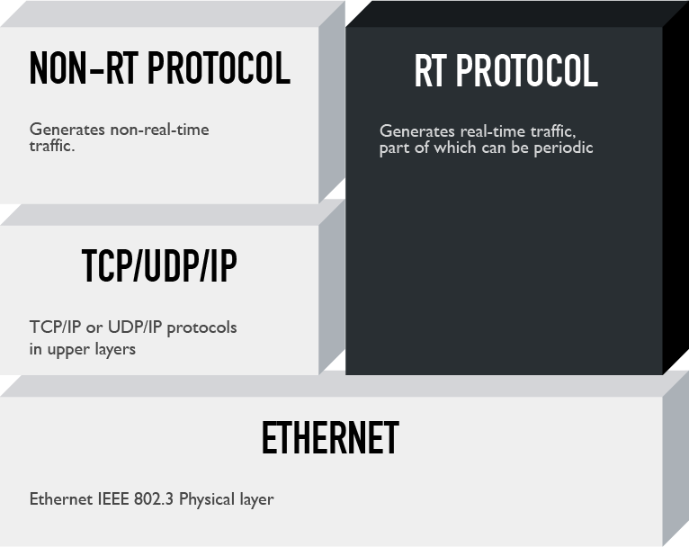

# Realizartion on Top of Ethernet

This realization creates a separation between the real-time and the non-real-time traffic, enabling the former to bypass the DLL and reach Ethernet, thus prioritizing real-time traffic.

As it is possible t